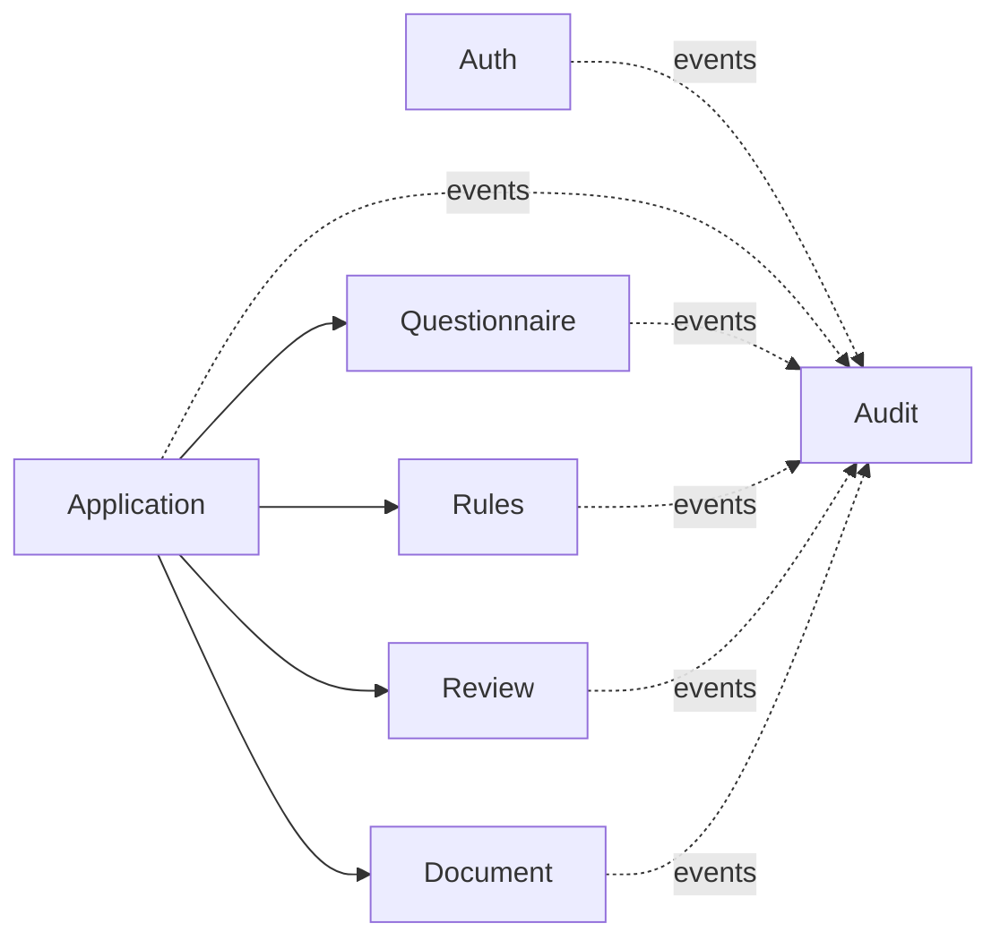

# Adiaphora Bankruptcy Platform

[](https://github.com/GalinaBP/adiaphora/actions/workflows/ci.yml)

Backend for a document-preparation platform for Russian personal-bankruptcy cases. It is built as a
**modular monolith**: one Spring Boot application, one MySQL database, one deployable artifact, with
strictly enforced module boundaries.

> **Status:** technical foundation. The questionnaire content and the legal rules are **placeholders**
> and must be reviewed and approved by a lawyer before any real use.

## Prerequisites

- **JDK 21** (the build targets Java 21; Spring Boot 4.1 supports 17+)
- **Maven 3.9+** (or use the wrapper — see below)
- **Docker + Docker Compose** (for MySQL and containerised runs)
- MySQL 8.4 if you prefer to run the database yourself

## Maven Wrapper

The wrapper is configured in [.mvn/wrapper/maven-wrapper.properties](.mvn/wrapper/maven-wrapper.properties)
but the `mvnw` / `mvnw.cmd` scripts are **generated once** (they are not committed as a binary jar):

```bash
mvn -N wrapper:wrapper
```

After that, `./mvnw` works as documented below.

## Project structure

Package-by-feature under `ru.adiaphora.platform`:

```
auth/           registration, login, tokens, roles
application/    the bankruptcy case lifecycle (NOT the Spring app)
questionnaire/  versioned questionnaire, sections, questions, answers
rules/          deterministic rule engine, preliminary route
review/         manual review workflow
document/       document templates, generation requests, storage abstraction
audit/          immutable, event-driven audit log
common/         shared technical building blocks (errors, security, web, config)
```

Every business module is split into `api` / `application` / `domain` / `infrastructure`. Modules may
depend only on another module's **`api`** package, or communicate via Spring application events. This
is verified automatically (see Tests).

## Local startup

Full stack via Compose — MySQL, MinIO (object storage), Mailpit (mail), backend, and a placeholder
frontend, all with health checks:

```bash
cp .env.example .env
docker compose up --build
```

Services: frontend :3000 · backend :8080 · MySQL :3306 · MinIO :9000 (console :9001) · Mailpit :8025.

Optional dev tools (Adminer DB UI on :8081):

```bash
docker compose --profile dev-tools up --build
```

App only (against a MySQL you provide), local profile:

```bash
./mvnw spring-boot:run
```

## Tests

```bash
./mvnw clean verify
```

This runs unit, integration (Testcontainers + real MySQL), security, and **architecture** tests:

- `ModularityTest` — Spring Modulith boundary verification + module docs generation.
- `LayeredArchitectureTest` — ArchUnit rules (domain not depending on infrastructure, controllers not
  calling repositories, `common` not depending on business modules).

## Swagger / OpenAPI

Enabled **only** in the `local` profile:

- Swagger UI: <http://localhost:8080/swagger-ui.html>
- OpenAPI JSON: <http://localhost:8080/v3/api-docs>

Disabled in `prod`.

## Local accounts

Synthetic seed accounts are created **only** in the `local` profile (never in `prod`/`test`). See
[docs/local-development.md](docs/local-development.md). No real personal data is used.

## Database & migrations

Schema is owned by **Flyway** (`src/main/resources/db/migration`). Hibernate runs with
`ddl-auto: validate` — it never creates or alters tables. UUIDs are stored as `BINARY(16)`, money as
`DECIMAL(19,2)`, timestamps in UTC.

## Module dependency diagram



## Known limitations

- Targets Java 21 (Spring Boot 4.1 / Spring Modulith 2.0). If those exact dependency versions do not
  resolve from your Maven repositories, adjust them in `pom.xml` (e.g. Spring Boot 4.0.x).
- Rules and questionnaire content are **placeholders pending legal review**.
- Document generation is interface-only; the development storage adapter is filesystem/in-memory and
  is **not production-grade**.
- The Maven wrapper scripts must be generated once (see above).

## Documentation

- [docs/architecture.md](docs/architecture.md)
- [docs/modules.md](docs/modules.md)
- [docs/security.md](docs/security.md)
- [docs/database.md](docs/database.md)
- [docs/api.md](docs/api.md)
- [docs/local-development.md](docs/local-development.md)

## License

Proprietary — all rights reserved. See [LICENSE](LICENSE).
