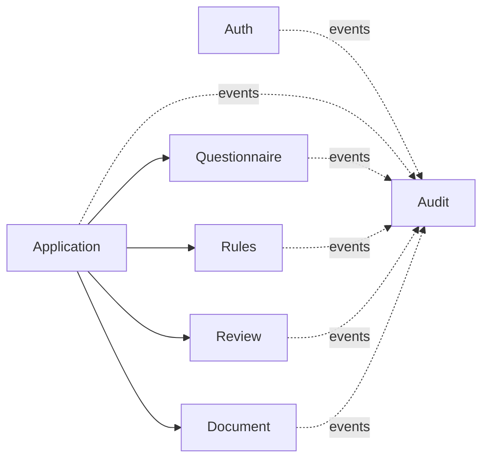

# Architecture

## Style

Modular monolith on Spring Boot. One deployable artifact, one MySQL schema, verified module
boundaries. This gives clear ownership and refactorable seams without the operational cost of
microservices. Splitting a module into a service later is a deliberate, evidence-driven step — not a
default.

## Modules

Feature modules under `ru.adiaphora.platform`, each with the same internal layering:

| Layer            | Responsibility                                                             |
|------------------|----------------------------------------------------------------------------|
| `api`            | Public interfaces + DTOs other modules may use. No JPA entities exposed.    |
| `application`    | Use cases, command/query handlers, transactions, orchestration, mapping.   |
| `domain`         | Aggregates, value objects, domain services/events, repository interfaces.  |
| `infrastructure` | REST controllers, JPA entities, Spring Data repositories, adapters, config. |

`common` holds only genuinely shared technical components and is declared a **shared module** so all
modules may use it. It must never depend on a business module.

## Communication rules

- A module may depend only on another module's **`api`** package.
- Side effects (especially audit) flow through **Spring application events**, not direct calls.
- Forbidden: reaching into another module's `infrastructure`/repositories.

Enforced by `ModularityTest` (Spring Modulith) and `LayeredArchitectureTest` (ArchUnit).

## Dependency direction

## Cross-cutting concerns

- **Errors:** one `@RestControllerAdvice` maps exceptions to the `ApiError` contract; framework/DB
  messages are never exposed.
- **Correlation id:** a servlet filter binds `X-Correlation-Id` to MDC for every request.
- **Security:** stateless, role-based URL rules in `common`; per-resource ownership checks live in
  the owning module's application service. The `auth` module contributes the token filter via the
  `HttpSecurityCustomizer` extension point so `common` stays independent of it.
- **Time:** an injectable UTC `Clock` bean; no direct `Instant.now()` in domain code.
